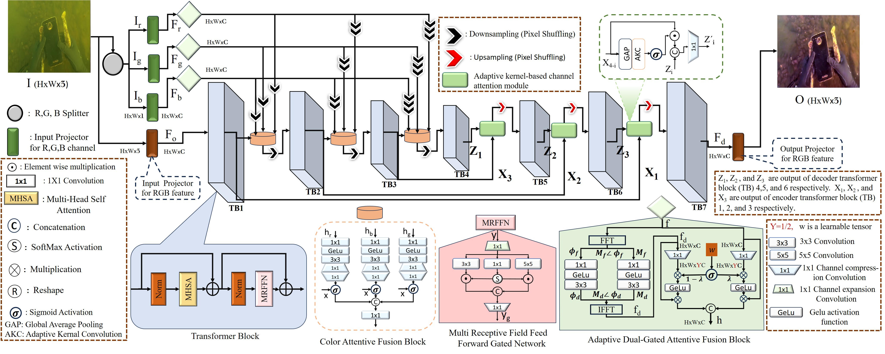

<p align="center">
  <h1 align="center">Attentive Color Fusion Transformer Network (ACFTNet) for Underwater Image Enhancement</h1>
  <p align="center">

Abstract:Underwater imagery often suffers from issues like color distortion, haze, and reduced visibility due to light’s interaction with water, posing challenges for applications like autonomous underwater vehicles. To address these obstacles effectively, we introduce the Attentive Color Fusion Transformer Network (ACFTNet) for underwater image enhancement. At the core of our proposal lies a novel Adaptive Dual-Gated Attentive Fusion Block (ADGAFB), which seamlessly integrates localized transmission features and global illumination characteristics. Subsequently, it employs a dua-gated mechanism to generate attentive features for each channel (R, G, and B). To ensure accurate color fidelity, we introduce the Color-Attentive Fusion Block. This block adeptly merges attentive features obtained from each R, G, and B channel, ensuring precise color representation. To selectively transmit features from the encoder to the corresponding decoder, we utilize an Adaptive Kernel-Based Channel Attention Module. Moreover, within the transformer block, we propose a Multi-Receptive Field Feed-Forward Gated Network to further refine the restoration process. Through comprehensive evaluations on benchmark synthetic (UIEB, EUVP) and real-world (UIEB (challenging-60), UCCS, U45) underwater image datasets, our method exhibits superior performance, as verified by extensive ablation studies and comparative analyses.

</p>
  <h3 align="center">ICPR-2024</h3>





# Evaluation 

To evaluate the model on different datasets using the provided checkpoints and sample degraded images.

## Dataset and Checkpoint Structure

- **Sample degraded images for testing**: Available in `dataset/dataset_name/`.
- **Checkpoints for evaluation**: Provided in `checkpoints/dataset-name/`.
- **Results storage**: After successful execution, the results will be saved in the `results/dataset-name/` folder.

### Folder Overview 
```
├── dataset
│   ├── UIEB
│   ├── U-45
│   ├── C-60
│   ├── UCCS

├── results
│   ├── UIEB
│   ├── U-45
│   ├── C-60
│   ├── UCCS


```
## Running the Evaluation

To evaluate the model on different datasets, follow the instructions below for each specific dataset:

### UIEB Dataset Evaluation
Run the following command to evaluate the model on the UIEB dataset:
```
python test.py --dataset datasets/UIEB/ --save_path Results/UIEB
```

###  U-45 Dataset Evaluation
Run the following command to evaluate the model on the U-45 dataset:
```
python test.py --dataset dataset/U-45/ --save_path Results/U-45
```
### C-60 Dataset Evaluation
Run the following command to evaluate the model on the SQUID dataset:
```
python test.py --dataset dataset/C-60/ --save_path Results/SQUID
```
### UCCS Dataset Evaluation
Run the following command to evaluate the model on the UCCS dataset:
```
python test.py --dataset dataset/UCCS/ --save_path Results/UCCS

```
## Training
1. Structure of data for training should be like
 ```Shell
 uw_data/
    ├── train/
    │   ├── a/  # Input images
    │   └── b/  # Reference (ground truth) images
    └── test/
        ├── a/  # Input images
        └── b/  # Reference (ground truth) images
```


3. run
```
  pyhthon train.py
```

## Citation
If you find this work helpful, please reference it as follows:
@inproceedings{wani2024attentive,
  title={Attentive Color Fusion Transformer Network (ACFTNet) for Underwater Image Enhancement},
  author={Wani, Mohd Ubaid and Khan, Md Raqib and Kulkarni, Ashutosh and Phutke, Shruti S and Vipparthi, Santosh Kumar and Murala, Subrahmanyam},
  booktitle={ICPR (21)},
  year={2024}
}
